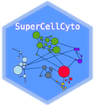

# SuperCellCyto 

<p>

</p>

SuperCellCyto is an extension of the [SuperCell R package](https://github.com/GfellerLab/SuperCell). 
Initially developed for scRNAseq data, SuperCell aggregates cells with similar transcriptomic profiles into "supercells" (also known as “metacells” in the scRNAseq literature).

In SuperCellCyto, we have adapted the SuperCell package specifically for cytometry data and implemented within-sample supercell creation, preventing supercells from containing cells across multiple samples. 
Additionally, we have also introduced parallel processing capabilities using a careful load balancing strategy, allowing the simultaneous creation of supercells across multiple samples, which significantly speeds up computational time.

## Vignettes and Function Documentation

To understand how SuperCellCyto can be integrated into your workflow, head over to the Articles page.
Click on the dropdown arrow of the `Articles` link in the navbar at the top of the website.
Our vignettes provide step-by-step guides, practical examples, and use-case scenarios that demonstrate the package's application in various research contexts.

Documentation and usage of each function in the SuperCellCyto package 
are available in the Reference page. 
Click on the `Reference` link in the navbar at the top of the website.

## Citation

If you use SuperCellCyto in your study, please kindly cite our preprint on bioRxiv:

Putri, G. H., Howitt, G., Marsh-Wakefield, F., Ashhurst, T. M., & Phipson, B. (2023). SuperCellCyto: enabling efficient analysis of large scale cytometry datasets. bioRxiv; DOI: https://doi.org/10.1101/2023.08.14.553168

## Installation

The package can be installed using `devtools`:

```
# Install devtools
install.packages("devtools")

# Install SuperCellCyto from this repository
devtools::install_github("phipsonlab/SuperCellCyto")
```

SuperCellCyto requires the [SuperCell R package](https://github.com/GfellerLab/SuperCell)
installed to run properly.
If you use the installation command above, it should be, in theory, automatically installed. 
But in the case it doesn't, please manually install it by running the following command beforehand:

```
# Install SuperCell from their github repository
devtools::install_github("GfellerLab/SuperCell")
```

## Code of Conduct

Please note that the SuperCellCyto project is released with a [Contributor Code of Conduct](https://phipsonlab.github.io/SuperCellCyto/CODE_OF_CONDUCT.html). 
By contributing to this project, you agree to abide by its terms.

## Contribution guide

Please visit [Contributing Guide](https://phipsonlab.github.io/SuperCellCyto/CONTRIBUTING.html)


